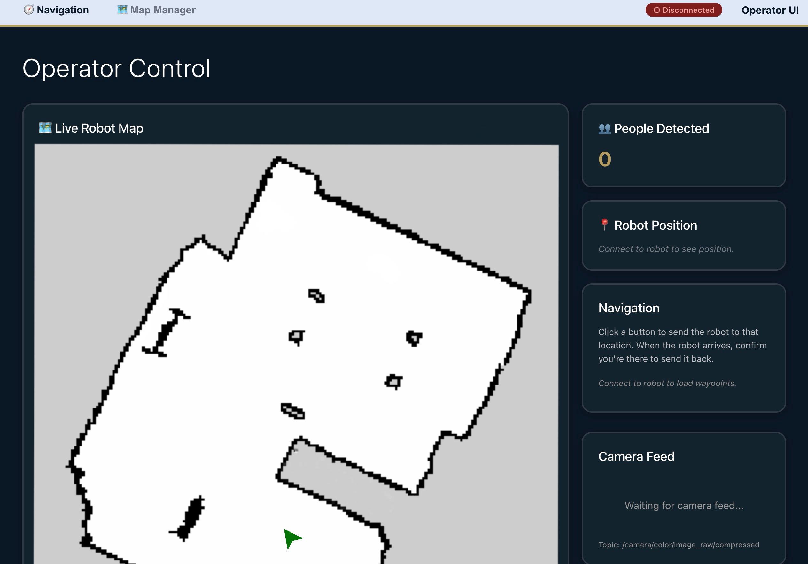
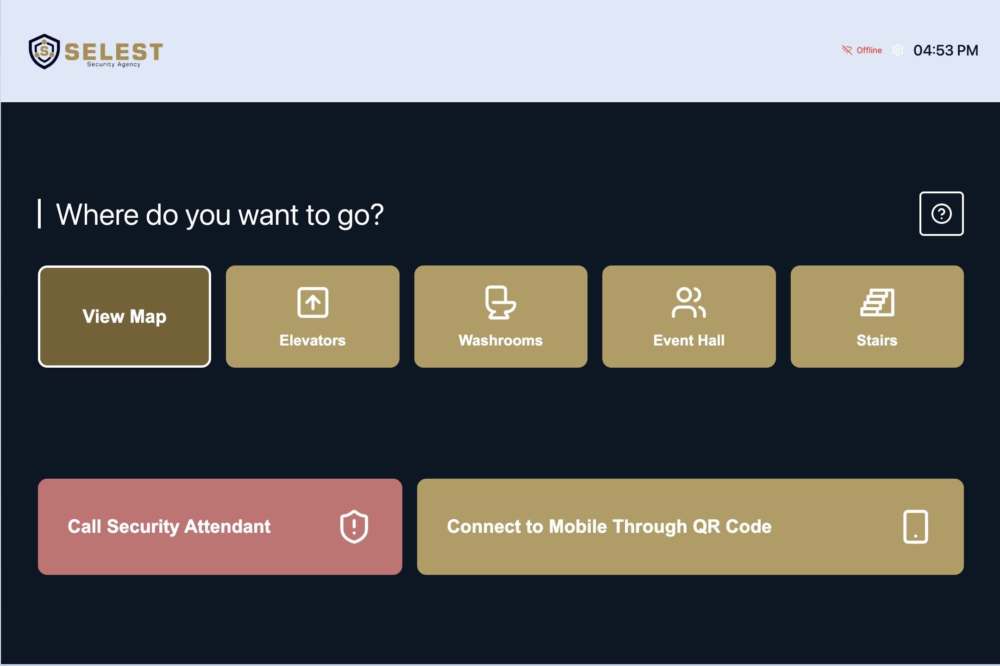
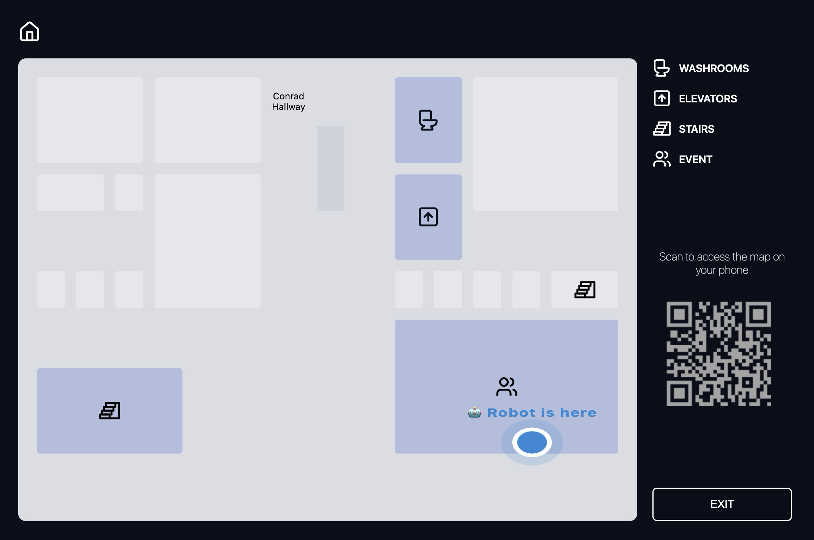

# Secur-a-Bot MOVO Service Robot Stack

Watch the full demo showing the complete robot stack in action:

https://github.com/Kushion32/security_robot/raw/master/media/fulldemo.mov

Please find the rest of the demonstration videos and photos sprinkled throughout the features sections below.

The project implemented below includes a full ROS-based software stack for a MOVO service robot, featuring:

- Navigation to waypoints with UI integration
- Person-following safety behavior using leg detection
- Automatic head/screen flipping interactions
- Real-time person counting using YOLOv8 on RealSense camera feed
- Face authentication for unauthorized user detection
- Easy map management for SLAM and room labeling
- Operator UI (`movo-nav-ui`) and attendee UI (`secure-a-bot-ui/robot-ui`)

## Overview

This repository combines ROS navigation, interaction behaviors, and two web UIs:

- `movo-nav-ui`: operator-facing dashboard for navigation and map tools
- `secure-a-bot-ui/robot-ui`: attendee-facing touchscreen UI for selecting destinations
- `src/kinova-movo/movo_nav`: waypoint backend (`goto_points.py`) and nav integration
- `src/kinova-movo/movo_people`: people detection, person-following monitor, head/screen flip nodes

## Features

### 1. Waypoint Navigation

- Send robot to named waypoints from UI or terminal
- Return robot to home after user confirmation
- Publishes UI-ready status and arrival topics:
  - `/ui_nav_ready`
  - `/ui_waypoints_list`
  - `/ui_robot_arrived`

### 2. Person-Following Safety

- Uses leg detections and monitor logic to ensure user remains with robot
- Robot pauses if person is lost and can resume when person returns
- Key topics:
  - `/leg_tracker_measurements`
  - `/movo/person_following_status`

### 3. Head/Screen Interaction

- Auto mode: detect the side a person is standing on from depth, rotate head/tablet side accordingly
- Supports return-to-front behavior when robot navigation trip is complete and user sends robot back
- Interfaces:
  - Service mode: `/movo/flip_to_back_screen`, `/movo/flip_to_front_screen`
  - Auto mode topics: `/movo/auto_screen_flip/command`, `/movo/auto_screen_flip/state`

### 4. Person Counting

- Uses YOLOv8 object detection on RealSense color camera stream
- Continuously counts number of people in the camera's field of view
- Publishes count to `/people/count` (std_msgs/Int32)

### 5. Face Authentication (Unauthorized User Detection)

- Validates faces against authorized profiles using `face_recognition`
- Identifies whether a detected person is an authorized user or unauthorized
- Publishes status to `/face_auth/status` (std_msgs/String)
- Publishes annotated camera feed with bounding boxes to `/face_auth/overlay`
- Authorized face encodings are loaded from a local directory (e.g., `config/known_faces/`) and should be pre-populated with images of authorized users (e.g., `me.jpg`)

### 6. Map Manager (SLAM & Room Labeling)

- Handles dynamic SLAM map saving and loading during runtime
- Manages room labels and mapping statuses dynamically
- Interface: JSON command inputs on `/map_manager/command`
- Publishes JSON status on `/map_manager/status`

### 7. Operator UI (MOVO UI)

- ROS-connected operator dashboard
- Waypoint/nav control and map utilities
- Path: `movo-nav-ui`

### 8. Attendee UI (Secure-a-Bot UI)

- Touch-friendly destination selection for attendees
- Hardcoded destination buttons mapped to waypoint names (e.g. `washroom`, `elevator`, `stairs`)
- Path: `secure-a-bot-ui/robot-ui`

## Repository Layout

```text
catkin_ws/
	src/kinova-movo/
		movo_nav/
		movo_people/
		movo_demos/
		...
	movo-nav-ui/
	secure-a-bot-ui/robot-ui/
	COMMANDS.md
```

## Prerequisites

- Ubuntu + ROS Noetic
- Catkin workspace configured at `~/catkin_ws`
- MOVO robot network access (movo1/movo2 reachable)
- Node.js and npm for both UIs

## Robot Bring-Up

1. Power on MOVO main system (movo1).
2. Power on secondary computer (movo2) from the back panel.
3. Verify connectivity:

```bash
ping movo1
ping movo2
```

4. Source ROS workspace:

```bash
cd ~/catkin_ws
source devel/setup.bash
```

5. Follow the rest of the setup instructions in 'src/kinova-movo/README.md' for extra networking setup

## Recommended ROS Environment

Set ROS networking in each terminal (update values for your network):
The below works when connected to 'movo' networking projected by the robot

```bash
export ROS_MASTER_URI=http://10.66.171.2:11311
export ROS_IP=10.66.171.254
export ROS_HOSTNAME=10.66.171.254
source ~/catkin_ws/devel/setup.bash
```

Notes:

- Use the interface/IP reachable by the robot network.
- If running over wired tether, prefer the robot subnet IP (for example `10.66.x.x`) instead of hotspot-only IPs.

## Build

```bash
cd ~/catkin_ws
catkin build
source devel/setup.bash
```

## Core Runtime Commands

Once you've gone through the launch commands on each of movo1 and movo2 as detailed in 'src/kinova-movo/README.md', you can run the following core commands for each feature:

### Navigation + Map

Run navigation stack:

```bash
roslaunch movo_demos map_nav.launch sim:=false local:=true map_file:=movo_map
```

Open RViz navigation view:

```bash
roslaunch movo_viz view_robot.launch function:=map_nav
```

Save map:

```bash
rosrun map_server map_saver -f ~/movo_map
```

### Waypoint Backend

Start waypoint navigator (UI mode):

```bash
rosrun movo_nav goto_points.py _interactive:=false _ui_mode:=true
```

Other modes:

```bash
# No UI confirmation required
rosrun movo_nav goto_points.py _interactive:=false _ui_mode:=false

# Interactive terminal mode
rosrun movo_nav goto_points.py

# Custom auto-return delay
rosrun movo_nav goto_points.py _ui_mode:=false _auto_return_delay:=10.0
```

### Person-Following + Leg Detection

Start person following system, can be used when navigating with waypoints:

```bash
roslaunch movo_people person_following_navigation.launch
```

Verify detections/status:

```bash
rostopic echo /leg_tracker_measurements
rostopic echo /movo/person_following_status
```

### Head/Screen Flip

Manual service-based node:

```bash
rosrun movo_people screen_flip_node.py
rosservice call /movo/flip_to_back_screen
rosservice call /movo/flip_to_front_screen
```

Automatic depth-based node:

```bash
roslaunch movo_people auto_screen_flip.launch trigger_distance_m:=0.40 clear_distance_m:=0.60
```

Monitor/send commands:

```bash
rostopic echo /movo/auto_screen_flip/state
rostopic pub -1 /movo/auto_screen_flip/command std_msgs/String "data: 'home'"
```

### Person Counting

Run the YOLOv8 person counting node (connects to `/camera/color/image_raw`):

```bash
rosrun movo_people realsense_person_counter.py
```

Monitor count:

```bash
rostopic echo /people/count
```

### Face Authentication (Unauthorized User Detection)

Run the face authentication node (requires pre-configured known face image `me.jpg` in config):

```bash
roslaunch movo_nav face_authentication.launch
```

Monitor status and view video feed:

```bash
rostopic echo /face_auth/status
rosrun image_view image_view image:=/face_auth/overlay
```

### Map Manager (SLAM & Saved Maps)

Start the runtime mapping session and label manager Node:

```bash
rosrun movo_nav map_manager.py
```

Send a command manually to list saved maps or start mapping:

```bash
rostopic pub -1 /map_manager/command std_msgs/String "data: '{\"action\": \"start_mapping\"}'"
rostopic pub -1 /map_manager/command std_msgs/String "data: '{\"action\": \"list_maps\"}'"
```

## Operator UI Setup (`movo-nav-ui`)

```bash
cd ~/catkin_ws/movo-nav-ui
npm install
npm start
```

Default local URL: `http://localhost:3000`

## Attendee UI Setup (`secure-a-bot-ui/robot-ui`)

```bash
cd ~/catkin_ws/secure-a-bot-ui/robot-ui
npm install
npm run dev
```

If needed, set ROSBridge URL in UI settings or via env before launch:

```bash
export VITE_ROSBRIDGE_URL=ws://<rosbridge_host>:9090
```

## ROS Topics and Commands Used by UIs

### Subscribed by UI

- `/ui_nav_ready` (`std_msgs/Bool`)
- `/ui_waypoints_list` (`std_msgs/String`, JSON array)
- `/ui_robot_arrived` (`std_msgs/String`)

### Published by UI

- `/ui_navigation_command` (`std_msgs/String`)
  - `go:<waypoint_name>`
  - `confirm:<waypoint_name>`

Example:

```bash
rostopic pub -1 /ui_navigation_command std_msgs/String "data: 'go:washroom'"
rostopic pub -1 /ui_navigation_command std_msgs/String "data: 'confirm:washroom'"
```

## Demo Media

Add your recorded media here.

### Navigation Demo

- Notes: Navigation testing

### Person Following + Leg Detection Demo

- Notes: Shows the safety behavior using leg detection

### Head Turn / Screen Flip Demo

https://github.com/Kushion32/security_robot/raw/master/media/headmoving.MOV

### Person Counting Demo

- Notes: Evaluates YOLOv8 counts

### Face Authentication (Unauthorized User Detection) Demo

https://github.com/Kushion32/security_robot/raw/master/media/facedetection.mp4

### Map Manager (Live SLAM & Room Labels) Demo

- Notes: Live SLAM demonstrations

### Operator UI Demo



### Attendee UI Demo




## Troubleshooting

### UI connects but robot does not move

- Check `goto_points.py` is running.
- Check nav readiness:

```bash
rostopic echo /ui_nav_ready
```

- Confirm action server exists:

```bash
rostopic list | grep move_base
```

### Waypoint unknown errors

- Confirm waypoint file contains the exact key name:

```bash
cat ~/catkin_ws/src/kinova-movo/movo_nav/movo_waypoints.yaml
```

- Confirm UI command:

```bash
rostopic echo /ui_navigation_command
```

### Robot starts at wrong map location (orange AMCL marker off-map)

- In RViz, use `2D Pose Estimate` to set initial pose.
- Rotate robot slowly in place to converge AMCL.

### Head does not return to front after attendee confirmation

- Ensure either of these is active:
  - `screen_flip_node.py` (service path)
  - `auto_screen_flip_node.py` (topic command path)

## Acknowledgements

- Kinova MOVO ROS packages and navigation stack
- ROS Noetic ecosystem packages (`move_base`, `amcl`, `map_server`, etc.)
